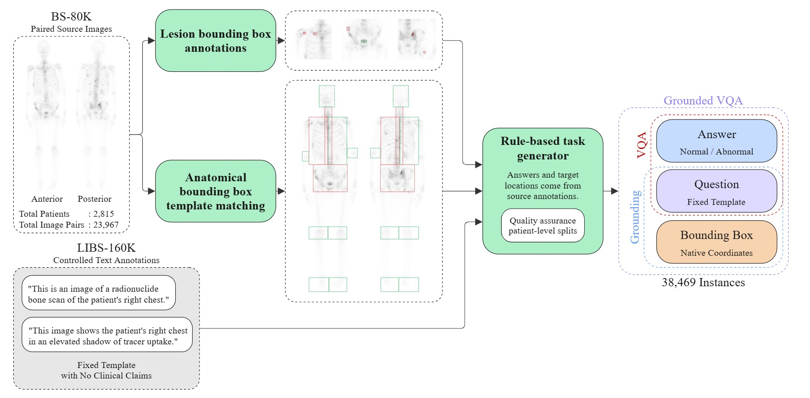
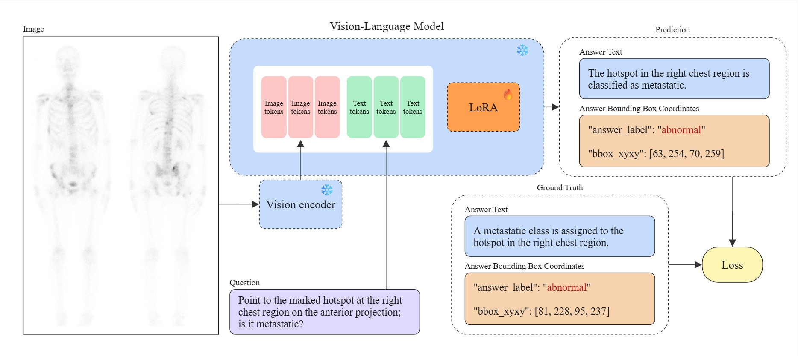
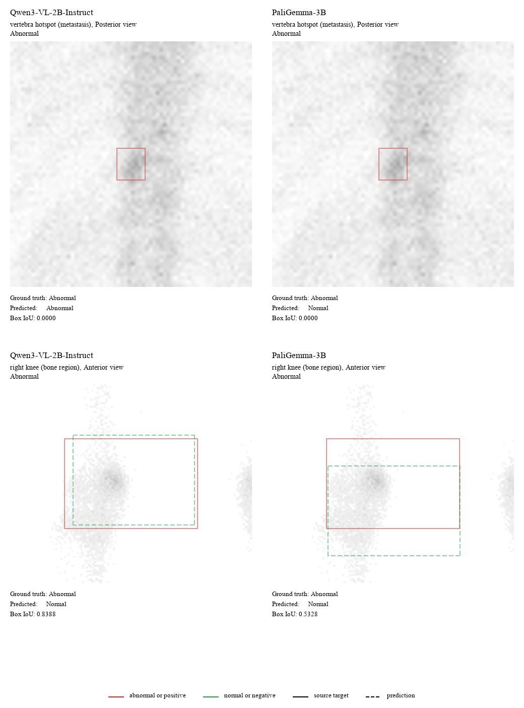

# wbbs-vlm-experiment

Code, configurations, and evaluation scripts for ScintiGround-38K, a grounded visual question answering benchmark for paired anterior and posterior whole-body bone scintigraphy. This repository is part of that research: it builds the benchmark from BS-80K annotations and LIBS-160K question templates, fine-tunes two vision-language models on it, and scores them. The manuscript is under review.

## The benchmark

ScintiGround-38K has 38,469 instances. One instance is one question or request about one target in one patient's paired anterior and posterior scan, with the outputs it requires. All boxes and answers come from BS-80K annotations, and question wording comes from fixed LIBS-160K templates.

| Task | Required output | Train | Validation | Test | Total |
| --- | --- | ---: | ---: | ---: | ---: |
| VQA | yes or no answer | 10,726 | 1,340 | 1,305 | 13,371 |
| Image localization | one or two boxes | 10,068 | 1,256 | 1,225 | 12,549 |
| Grounded VQA | answer and one or two boxes | 10,068 | 1,257 | 1,224 | 12,549 |
| Total | | 30,862 | 3,853 | 3,754 | 38,469 |

The instances come from 54,768 source records (51,803 normal, 2,965 abnormal) and 23,967 anterior and posterior image pairs from 2,815 patients. Patients are split 80%, 10%, and 10%, and every record of a patient stays in one split.



## Baselines

Qwen3-VL-2B-Instruct and PaliGemma-3B-pt-224 were fine-tuned with LoRA (4-bit NF4, rank 8, alpha 16, learning rate 5e-5, effective batch size 8, seed 5070, two epochs) on the same multitask training set. The epoch with the best validation score was kept, and the locked test split was evaluated after that choice. Qwen3-VL receives the two images natively; PaliGemma receives them composed into one canvas.



## Results

Locked test split. Accuracy is high because 94.6% of the source labels are normal; balanced accuracy and abnormal-class F1 show how little of the minority class the models recover.

| Model | Task | Accuracy | Balanced accuracy | Macro-F1 |
| --- | --- | ---: | ---: | ---: |
| Qwen3-VL-2B-Instruct | VQA | 0.886 | 0.528 | 0.529 |
| PaliGemma-3B-pt-224 | VQA | 0.888 | 0.535 | 0.541 |
| Qwen3-VL-2B-Instruct | Grounded VQA | 0.906 | 0.539 | 0.550 |
| PaliGemma-3B-pt-224 | Grounded VQA | 0.908 | 0.524 | 0.524 |

| Model | Task | Mean IoU | Box accuracy (IoU at least 0.50) | Strict localization accuracy | Valid responses |
| --- | --- | ---: | ---: | ---: | ---: |
| Qwen3-VL-2B-Instruct | Image localization | 0.642 | 0.857 | 0.827 | 0.998 |
| PaliGemma-3B-pt-224 | Image localization | 0.633 | 0.787 | 0.762 | 1.000 |
| Qwen3-VL-2B-Instruct | Grounded VQA | 0.640 | 0.843 | 0.765 | 0.999 |
| PaliGemma-3B-pt-224 | Grounded VQA | 0.629 | 0.776 | 0.701 | 1.000 |

| Model | Task | Normal precision | Normal recall | Normal F1 | Abnormal precision | Abnormal recall | Abnormal F1 |
| --- | --- | ---: | ---: | ---: | ---: | ---: | ---: |
| Qwen3-VL-2B-Instruct | VQA | 0.897 | 0.985 | 0.939 | 0.357 | 0.071 | 0.118 |
| PaliGemma-3B-pt-224 | VQA | 0.899 | 0.985 | 0.940 | 0.414 | 0.085 | 0.141 |
| Qwen3-VL-2B-Instruct | Grounded VQA | 0.913 | 0.991 | 0.951 | 0.526 | 0.087 | 0.149 |
| PaliGemma-3B-pt-224 | Grounded VQA | 0.910 | 0.996 | 0.951 | 0.600 | 0.052 | 0.096 |



PaliGemma's patient-cluster bootstrap 95% intervals (2,000 resamples, 281 test patients): VQA balanced accuracy 0.511 to 0.561, localization IoU at 0.5 0.755 to 0.815, grounded VQA strict accuracy 0.666 to 0.734. The two models differ in image input, so the table does not rank model families.

Predicting the locked test split again with the same Qwen3-VL adapter, without retraining, changes the headline metrics by up to 0.025, because batched greedy decoding depends on batch size and hardware:

| Run | VQA balanced accuracy | Localization IoU at 0.5 | Strict grounded accuracy |
| --- | ---: | ---: | ---: |
| Reported | 0.5277 | 0.8567 | 0.7647 |
| RTX 5070 Ti, second prediction set | 0.5518 | 0.8697 | 0.7884 |
| RTX 4050, batch 8 | 0.5384 | 0.8521 | 0.7639 |

## Repository layout

| Path | Contents |
| --- | --- |
| `src/preprocess` | source import, quality checks, pairing, and the task builders |
| `src/training` | LoRA fine-tuning and prediction for Qwen3-VL and PaliGemma |
| `src/postprocess` | model output parsers and training exports |
| `src/metric` | VQA, grounding, and text metrics, patient-cluster bootstrap |
| `src/analysis` | dataset audits, comparison with other datasets, image-free baselines |
| `configs` | dataset policies and experiment configurations (`configs/registry.md` lists them) |
| `scripts` | launchers, dataset rebuild, locked-test scoring, model comparison |
| `tests` | unit tests |

## Reproduce

The code expects a project folder with `datasets/` and `models/` next to `repo/` (set `WBBS_PROJECT_ROOT` to use another location). The images, the derived annotations, and the model weights are not in this repository.

```powershell
uv sync --extra training --extra dev --extra analysis --extra eval
uv run python scripts/regenerate_dataset.py
.\scripts\run_qwen3_r3_multitask_2epoch_fast.ps1 -Preflight -Profile 5070
.\scripts\run_paligemma_multitask.ps1
uv run python scripts/score_locked_test.py --expected <multitask_test.jsonl> --predictions <predictions.jsonl> --metrics-output <metrics.json> --bootstrap-output <bootstrap.json>
```

`regenerate_dataset.py` rebuilds the benchmark from the BS-80K and LIBS-160K sources and compares every file with the frozen release. The training launchers do not touch the locked test split unless asked.

## Data

| Source | Terms |
| --- | --- |
| BS-80K (Huang et al., Comput Biol Med 151:106221, 2022) | no license stated; images are not redistributed |
| LIBS-160K (Wei, figshare, DOI 10.6084/m9.figshare.28715375) | CC BY 4.0 |

For research use only, not for clinical decisions. A code license has not been chosen yet. See `CONTRIBUTING.md` for annotation corrections.
